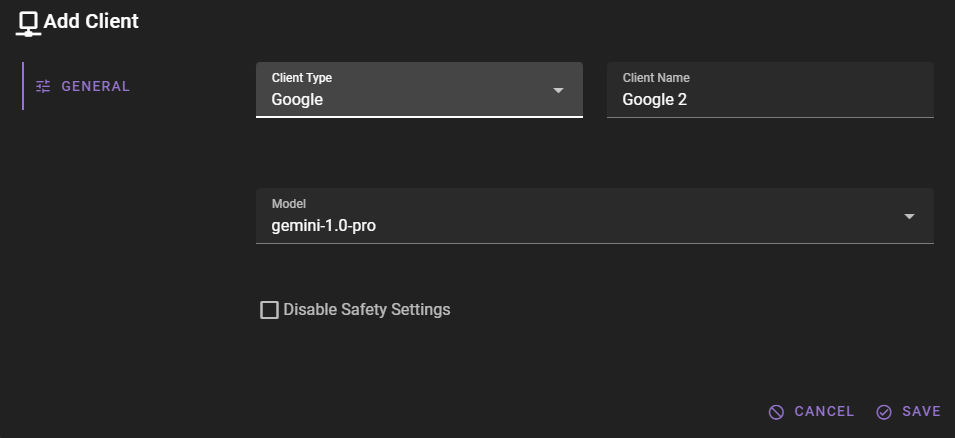
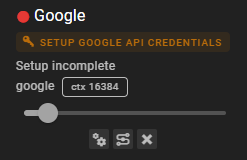
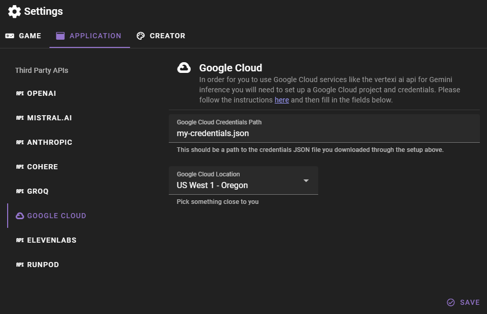
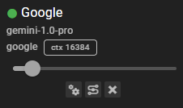

# Talemate

Roleplay with AI with a focus on strong narration and consistent world and game state tracking.

|||
|------------------------------------------|------------------------------------------|
|||
|||

Supported APIs:
- [OpenAI](https://platform.openai.com/overview)
- [Anthropic](https://www.anthropic.com/)
- [mistral.ai](https://mistral.ai/)
- [Cohere](https://www.cohere.com/)
- [Groq](https://www.groq.com/)
- [Google Gemini](https://console.cloud.google.com/)

Supported self-hosted APIs:
- [KoboldCpp](https://koboldai.org/cpp) ([Local](https://koboldai.org/cpp), [Runpod](https://koboldai.org/runpodcpp), [VastAI](https://koboldai.org/vastcpp), also includes image gen support)
- [oobabooga/text-generation-webui](https://github.com/oobabooga/text-generation-webui) (local or with runpod support)
- [LMStudio](https://lmstudio.ai/)

Generic OpenAI api implementations (tested and confirmed working):
- [DeepInfra](https://deepinfra.com/)
- [llamacpp](https://github.com/ggerganov/llama.cpp) with the `api_like_OAI.py` wrapper
- let me know if you have tested any other implementations and they failed / worked or landed somewhere in between

## Core Features

- Multiple AI agents for dialogue, narration, summarization, direction, editing, world state management, character/scenario creation, text-to-speech, and visual generation
- Support for multiple AI clients and APIs
- Long-term memory using ChromaDB and passage of time tracking
- Narrative world state management to reinforce character and world truths
- Creative tools for managing NPCs, AI-assisted character, and scenario creation with template support
- Context management for character details, world information, past events, and pinned information
- Integration with Runpod
- Customizable templates for all prompts using Jinja2
- Modern, responsive UI

# Instructions

Please read the documents in the `docs` folder for more advanced configuration and usage.

- [Quickstart](#quickstart)
    - [Installation](#installation)
        - [Windows](#windows)
        - [Linux](#linux)
        - [Docker](#docker)
    - [Connecting to an LLM](#connecting-to-an-llm)
        - [OpenAI / mistral.ai / Anthropic](#openai--mistralai--anthropic)
        - [Text-generation-webui / LMStudio](#text-generation-webui--lmstudio)
            - [Specifying the correct prompt template](#specifying-the-correct-prompt-template)
            - [Recommended Models](#recommended-models)
        - [DeepInfra via OpenAI Compatible client](#deepinfra-via-openai-compatible-client)
        - [Google Gemini](#google-gemini)
            - [Google Cloud Setup](#google-cloud-setup)
    - [Ready to go](#ready-to-go)
    - [Load the introductory scenario "Infinity Quest"](#load-the-introductory-scenario-infinity-quest)
    - [Loading character cards](#loading-character-cards)
- [Configure for hosting](#configure-for-hosting)
- [Text-to-Speech (TTS)](docs/tts.md)
- [Visual Generation](docs/visual.md)
- [ChromaDB (long term memory) configuration](docs/chromadb.md)
- [Runpod Integration](docs/runpod.md)
- [Prompt template overrides](docs/templates.md)


## DeepInfra via OpenAI Compatible client

You can use the OpenAI compatible client to connect to [DeepInfra](https://deepinfra.com/).


```
API URL: https://api.deepinfra.com/v1/openai
```

Models on DeepInfra that work well with Talemate:

- [mistralai/Mixtral-8x7B-Instruct-v0.1](https://deepinfra.com/mistralai/Mixtral-8x7B-Instruct-v0.1) (max context 32k, 8k recommended)
- [cognitivecomputations/dolphin-2.6-mixtral-8x7b](https://deepinfra.com/cognitivecomputations/dolphin-2.6-mixtral-8x7b) (max context 32k, 8k recommended)
- [lizpreciatior/lzlv_70b_fp16_hf](https://deepinfra.com/lizpreciatior/lzlv_70b_fp16_hf) (max context 4k)

## Google Gemini

### Google Cloud Setup

Unlike the other clients the setup for Google Gemini is a bit more involved as you will need to set up a google cloud project and credentials for it.

Please follow their [instructions for setup](https://cloud.google.com/vertex-ai/docs/start/client-libraries) - which includes setting up a project, enabling the Vertex AI API, creating a service account, and downloading the credentials.

Once you have downloaded the credentials, copy the JSON file into the talemate directory. You can rename it to something that's easier to remember, like `my-credentials.json`.

### Add the client



The `Disable Safety Settings` option will turn off the google reponse validation for what they consider harmful content. Use at your own risk.

### Conmplete the google cloud setup in talemate



Click the `SETUP GOOGLE API CREDENTIALS` button that will appear on the client.

The google cloud setup modal will appear, fill in the path to the credentials file and select a location that is close to you.



Click save and after a moment the client should have a green dot next to it, indicating that it is ready to go.



## Ready to go

You will know you are good to go when the client and all the agents have a green dot next to them.


## Load the introductory scenario "Infinity Quest"

Generated using talemate creative tools, mostly used for testing / demoing.

You can load it (and any other talemate scenarios or save files) by expanding the "Load" menu in the top left corner and selecting the middle tab. Then simple search for a partial name of the scenario you want to load and click on the result.


## Loading character cards

Supports both v1 and v2 chara specs.

Expand the "Load" menu in the top left corner and either click on "Upload a character card" or simply drag and drop a character card file into the same area.


Once a character is uploaded, talemate may actually take a moment because it needs to convert it to a talemate format and will also run additional LLM prompts to generate character attributes and world state.

Make sure you save the scene after the character is loaded as it can then be loaded as normal talemate scenario in the future.

## Configure for hosting

By default talemate is configured to run locally. If you want to host it behind a reverse proxy or on a server, you will need create some environment variables in the `talemate_frontend/.env.development.local` file

Start by copying `talemate_frontend/example.env.development.local` to `talemate_frontend/.env.development.local`.

Then open the file and edit the `ALLOWED_HOSTS` and  `VUE_APP_TALEMATE_BACKEND_WEBSOCKET_URL` variables.

```sh
ALLOWED_HOSTS=example.com
# wss if behind ssl, ws if not
VUE_APP_TALEMATE_BACKEND_WEBSOCKET_URL=wss://example.com:5050
```
