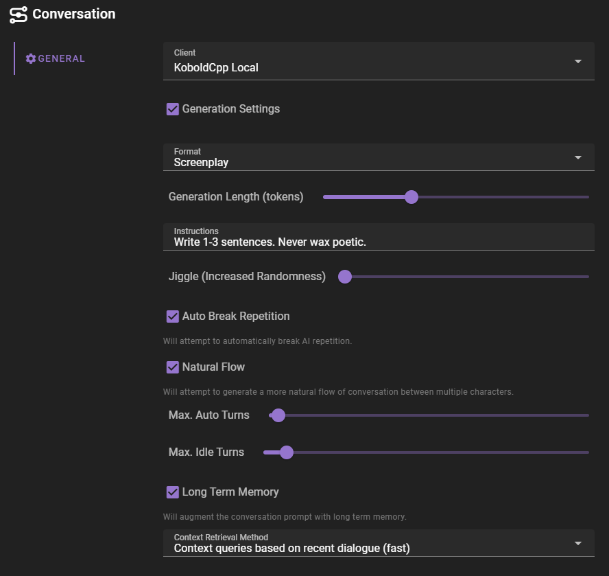

# Settings

!!! note "Inference perameters"
    Inference parameters are NOT configured through any individual agent.

    Please see the [Inference presets](/user-guide/clients/presets) section for more information on how to configure inference parameters.

##### Client

The text-generation client to use for conversation generation.

##### Generation settings

Checkbox that exposes further settings to configure the conversation agent generation.

##### Format

The dialogue format as the AI will see it.

This currently comes in two choices: 

- `Screenplay`
- `Chat (legacy)`

Visually this will make no difference to what you see, it may however affect how the AI interprets the dialogue.

##### Generation Length

The maximum length of the generated dialogue. (tokens)

##### Instructions

Extra instructions for the generation. This should be short and generic as it will be applied for all characters.

##### Jiggle

The amount of randomness to apply to the generation. This can help to avoid repetitive responses.

##### Auto Break Repetition

If checked and talemate detects a repetitive response (based on a threshold), it will automatically re-generate the resposne with increased randomness parameters.

##### Natural Flow

When there are multiple characters in the scene, this will help the AI to keep the conversation flowing naturally, making sure turns are somewhat evenly distributed, and also checking that the most relevant character gets the next turn, based on the context.

##### Max. Auto turns

Maximum turns the AI gets in succession, before the player gets a turn no matter what.

##### Max. Idle turns

The maximum number of turns a character can go without speaking before the AI will force them to speak.

##### Long Term Memory

If checked will inject relevant information into the context using relevancy through the [Memory Agent](/user-guide/agents/memory).

##### Context Retrieval Method

What method to use for long term memory selection

- `Context queries based on recent context` - will take the last 3 messagews in the scene and select relevant context from them. This is the fastes method, but may not always be the most relevant.
- `Context queries generated by AI` - will generaste a set of context queries based on the current scene and select relevant context from them. This is slower, but may be more relevant.
- `AI compiled questions and answers` - will use the AI to generate a set of questions and answers based on the current scene and select relevant context from them. This is the slowest, and not necessarily better than the other methods.

